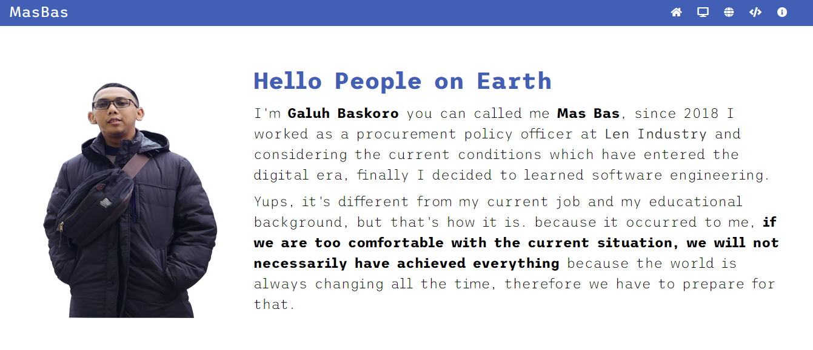
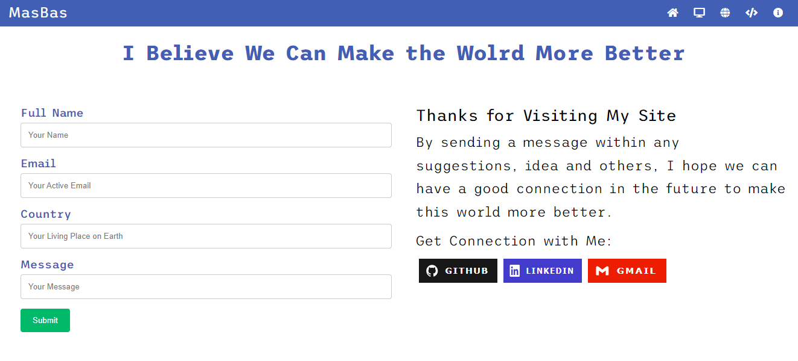
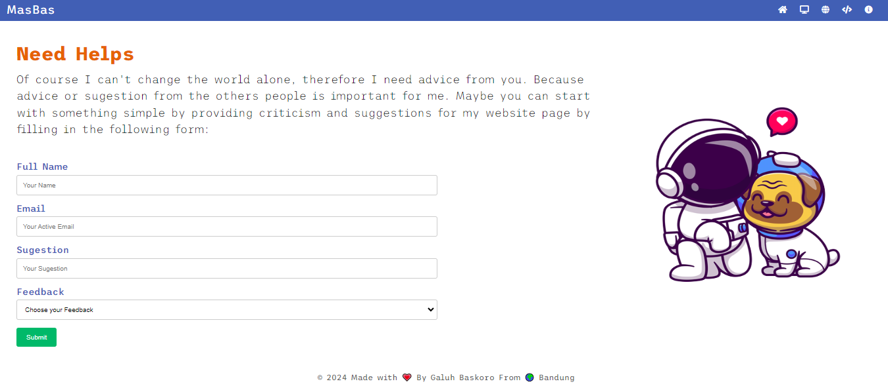

# Vanilla Web Portfolio 1.1

Vanilla Web Portfolio is website template that will used for personal web portfolio that contains severals thing for your personal branding, project collection, learning result, etc. 

This template is designed as a landing page that describes your identity in just one page. making it easier for visitors to find out your entire portfolio.

Visit demo site:

## Author

Hello people I'm <b>Galuh Baskoro</b> from the other side in Earth  
I’m interested in coding, music and hiking  
I’m student for software engineering faculty at Revou - Berlin

Connect with me:

## Features

- Mail contact form
- Visitor feedback
- Article contents

## Built With

## Installation

You can use this template on Github by cloning it or you can save it directly in zip format

<code>$ git clone https://github.com/revou-fsse-5/module-1-GaluhBaskoro.git</code>

## Preview

## Disclaimer

> ⚠ This application is learning result (advance assignment) of module 1 in software engineering program at Revou - Berlin. is not recommended use this reference for commercial purpose.
